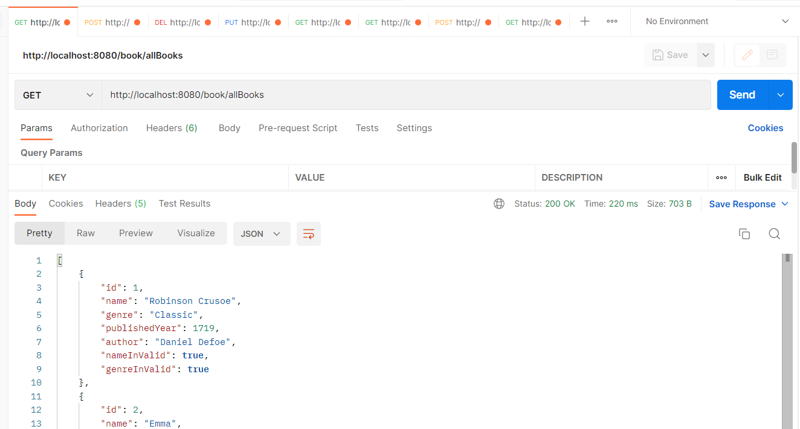
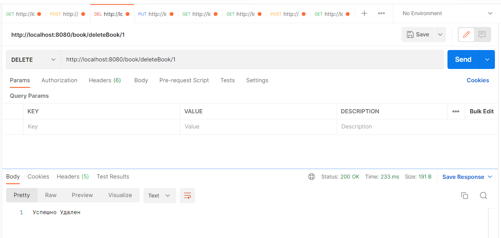
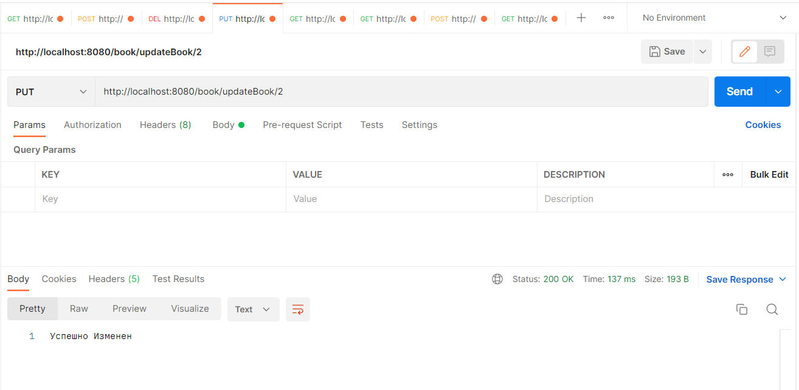
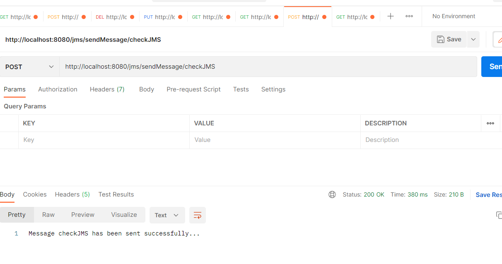
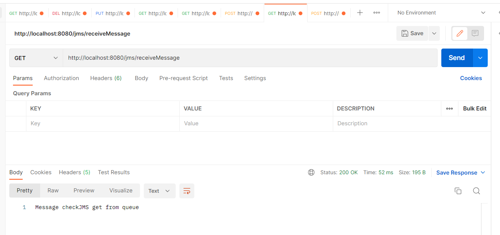

# LibraryManagementSystem

**Project description:** LMSystem is a software developed for managing basic functions of library like keeping records of borrowed books, new books, sorting them, keeping information about them.   
Today in libraries hard without tracking system. Thera are a lot of books and readers. It is unreal keep all information about each book in their mind. So, Library management system is required anywhere.   
LMS makes controlling all of this much easier, convenient and fast. Also, there is no need asking for books primarily librarian: everyone can use system in their needs.

**Project consists of packages: **
- authorization & security
  - Security classes
- config
  - 3 classes: appconfig, cacheConfig, SimpleCustomizer
- controller
  - 3 controllers: BookController, ProfileController, SecurityController
- jms
  - JmsController, MessageReceiver, MessageSender, MessagingConfiguration
- model
  - Book, Profile, Recomendations
- repository
  - BookRepository, ProfileRepository, RecomRepository (they are interfaces)
- validator
  - Simple Book Validator

**Project methods:**
*The system enables administrators to* 
-	Log in 
-	The addition, deletion and modification of books 
-	Search by author, name and etc
-	Tracking books: existing in library and borrowed
-	Payment details
*Readers*
-	Log in
-	See all books
-	Borrow and return books
-	Search by author, name and etc

**Modules:**
-	Insertion – for entering book, author information
-	Updating – update existing information.
-	ReportGeneration – show payments details for students.

**More about technicial parts:**
- As database used PostgreSql
- UML diagram is also included
- IOC, dependency injection
- Transactionality, JPA, queries
- REST API controllers: get, post, delete, put methods
- JMS messaging for managing errors
- Spring security, role based permissions

**REST API controller endpoints**

curl -X GET http://localhost:8080/book/allBooks  
curl -X POST http://localhost:8080/book/addBook  
curl -X DEL http://localhost:8080/book/deleteBook/1  
curl -X PUT http://localhost:8080/book/updateBook/2  
curl -X GET http://localhost:8080/profile/allProfiles  
curl -X POST http://localhost:8080/profile/addProfile  
curl -X DEL http://localhost:8080/profile/deleteProfile/1  
curl -X PUT http://localhost:8080/profile/updateaddProfile/2  
curl -X GET http://localhost:8080/book/getBooksByProfile  
curl -X POST http://localhost:8080/jms/sendMessage/checkJMS  
curl -X GET http://localhost:8080/jms/receiveMessage  

[//]: # (curl -X GET http://localhost:8080/book/findByAuthor  )

[//]: # (curl -X GET http://localhost:8080/book/findByGenre  )

[//]: # (curl -X GET http://localhost:8080/book/findByPublishedYear  )

[//]: # (curl -X GET http://localhost:8080/book/findById  )

[//]: # (curl -X GET http://localhost:8080/profile/findAll  )

[//]: # (curl -X GET http://localhost:8080/profile/findByFname  )

[//]: # (curl -X GET http://localhost:8080/profile/findByFnameAndLname  )

[//]: # (curl -X GET http://localhost:8080/profile/findByAge  )

[//]: # (curl -X GET http://localhost:8080/profile/findByLogin  )

**Postman screens:**

